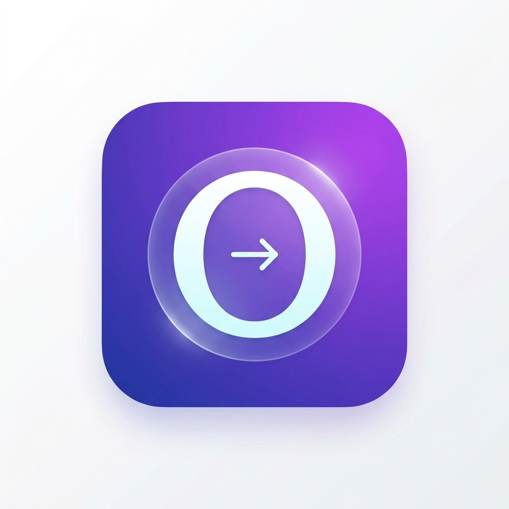
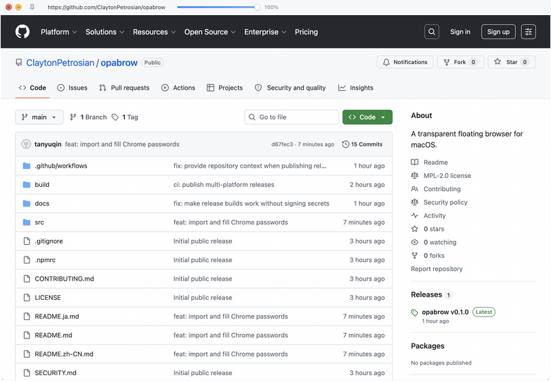

<p align="center">
  
</p>

<h1 align="center">opabrow</h1>

<p align="center"><strong>macOS 向けの透明フローティングブラウザ。</strong></p>

<p align="center">
  <a href="./README.md">English</a> · <a href="./README.zh-CN.md">简体中文</a> · <strong>日本語</strong>
</p>

<p align="center">
  <a href="https://github.com/ClaytonPetrosian/opabrow/blob/main/LICENSE"></a>
  
  
  
</p>

<p align="center">仕事の合間のひと息にも、調べものにも。気になるページをそばに置き、デスクトップは占有しない。</p>

<p align="center">
  
</p>

## opabrow とは

多くのブラウザウィンドウは作業空間全体を必要とします。opabrow は、仕事の合間の気分転換にも、参照資料、ライブダッシュボード、プレイリスト、Bilibili の動画など、ほかの作業の横でいつでも見られるようにしておきたいページにも使える軽量ブラウザです。デスクトップの端で静かに待機し、作業空間を奪いません。

タイトルバーは通常は透明で、ポインタを上端に移動したときだけ表示されます。独立した 32px の領域を持つため、コントロールが表示されてもウェブページを覆ったり、レイアウトをずらしたりしません。

| 邪魔をしない | すばやく移動 |
| --- | --- |
| フレームレスで透明なウィンドウ、ホバーで表示されるタイトルバー | アドレスバー、ローカル履歴の候補、戻る、進む、再読み込み、ホーム |
| 透明度の調整と任意の常に手前表示 | レスポンシブサイトを確認するためのモバイル User-Agent モード |
| アカウントやクラウド同期を必要としないローカル優先の履歴、ブックマーク、パスワード | macOS ネイティブメニューと一般的なキーボードショートカット |

## ダウンロード

[最新リリース](https://github.com/ClaytonPetrosian/opabrow/releases/latest) から macOS、Windows、Linux 向けのインストーラーをダウンロードできます。各リリースには以下を含みます。

- macOS Apple Silicon (`arm64`) および Intel (`x64`)
- Windows x64（`.exe` インストーラー）
- Linux x64（`.AppImage`）

## はじめに

### 必要環境

- macOS
- Node.js 22 以降
- pnpm 9 以降

### ローカルで実行する

```bash
git clone https://github.com/ClaytonPetrosian/opabrow.git
cd opabrow
pnpm install
pnpm dev
```

### ビルド

```bash
pnpm build
pnpm build:mac
```

## 小さくても便利なブラウザ

### アドレスバーと履歴

ポインタをウィンドウ上端へ移動するか、`Cmd+L` を押します。通常時は URL の文字列幅だけがクリックできるコンパクトな表示となり、タイトルバーの残りはウィンドウのドラッグに使えます。フォーカスすると入力欄が広がり、通常のコピー、カット、ペーストのショートカットを利用できます。

入力中はローカルのナビゲーション履歴から最大 5 件の候補が表示されます。候補はページタイトルを先に、URL を後に表示します。矢印キーで選択し、`Enter` で開きます。

**履歴 > 履歴を表示** または `Cmd+Shift+Y` で、最近開いたページの検索、再表示、消去ができます。**履歴** メニューからは直近 10 件をワンクリックで開けます。opabrow は最大 100 件の履歴だけをこの Mac にローカル保存し、アカウントやクラウド同期は使用しません。

デフォルトのホームページは opabrow プロジェクトのリポジトリです。**ブラウズ** メニューの **現在のページをホームに設定** から、閲覧中の任意のページをローカルのホームページにできます。**プロジェクトのホームを復元** でデフォルトへ戻せます。

### Bilibili の動画ページ

Bilibili の動画または Bangumi の再生ページを開くと、プレイヤーは自動的にウェブ全画面モードへ切り替わります。動画は利用可能なページ領域を埋めますが、opabrow のウィンドウ内にとどまります。

### ブックマークとブラウザからのインポート

macOS 上部の **ブックマーク** メニューで管理するため、閲覧画面の領域を占有しません。`Cmd+D` で現在のページを追加または削除し、メニューのフォルダ階層から直接リンクを開けます。ローカルの Chrome、Safari からのインポートと、ブラウザが出力した標準 HTML ブックマークファイルの選択に対応します。ブックマークのデータは opabrow のローカルアプリケーションデータ内にのみ保存されます。

### Chrome からのパスワード移行と手動入力

Chrome パスワードマネージャーからパスワード CSV を書き出し、opabrow の **パスワード > Chrome パスワード CSV をインポート…** を選ぶことで、保存済みログイン情報を意図的に移行できます。CSV は選択と警告の確認後にだけ読み込まれ、パスワードは opabrow のローカルアプリケーションデータへ書き込まれる前に macOS キーチェーンで暗号化されます。opabrow は Chrome の内部パスワードデータベースを読み取らず、パスワードをサーバーへ送信したり、クラウド同期したりしません。

一致する HTTPS オリジンでは、**パスワード > 現在のページを入力** または `Cmd+Shift+P` を選択します。ページ読み込み時に自動入力されることはありません。複数のアカウントが一致する場合は、先にアカウントを選択します。書き出した元の CSV は自身で管理し、移行後は削除してください。

### ウェブページの場所を奪わないウィンドウ操作

閉じるボタンと最小化ボタンはホバー時に滑らかに表示されます。webview は常にタイトルバーの下から始まるため、コントロールを表示してもページ内容と重なったりレイアウトが変わったりしません。

### デスクトップとモバイルモード

macOS メニューからモバイル User-Agent に切り替えると、サイトのレスポンシブ表示を確認できます。デスクトップモードへ戻しても、現在のページは失われません。

## キーボードショートカット

| ショートカット | 操作 |
| --- | --- |
| `Cmd+L` | アドレスバーにフォーカス |
| `Cmd+[` / `Cmd+]` | 戻る / 進む |
| `Cmd+R` | 再読み込み |
| `Cmd+Shift+H` | ホームを開く |
| `Cmd+T` | 常に手前表示を切り替え |
| `Cmd+=` / `Cmd+-` | ウィンドウ透明度を調整 |
| `Cmd+K` | コマンドパネルを開く |
| `Cmd+D` | 現在のページをブックマークに追加または削除 |
| `Cmd+Shift+P` | 保存済みパスワードで現在のページを入力 |

## 開発

```bash
pnpm typecheck
pnpm build
```

このプロジェクトは Electron と React で構築されています。Electron のメインプロセスはネイティブウィンドウと macOS メニューを管理し、レンダラープロセスはタイトルバー、アドレスバー、ローカル履歴、webview の操作を担当します。

## ロードマップ

無料コアでは、洗練されたフローティング閲覧体験に注力します。将来の Pro 向け実験ではワークスペース、プロファイル、任意の同期、自動化を追加する可能性がありますが、ローカル優先のコアは維持します。

## コントリビュート

バグ報告、デザインに関するフィードバック、焦点を絞った Pull Request を歓迎します。Pull Request を作成する前に [CONTRIBUTING.md](CONTRIBUTING.md) をお読みください。

## ライセンス

opabrow は [Mozilla Public License 2.0](LICENSE) のもとで公開されています。
